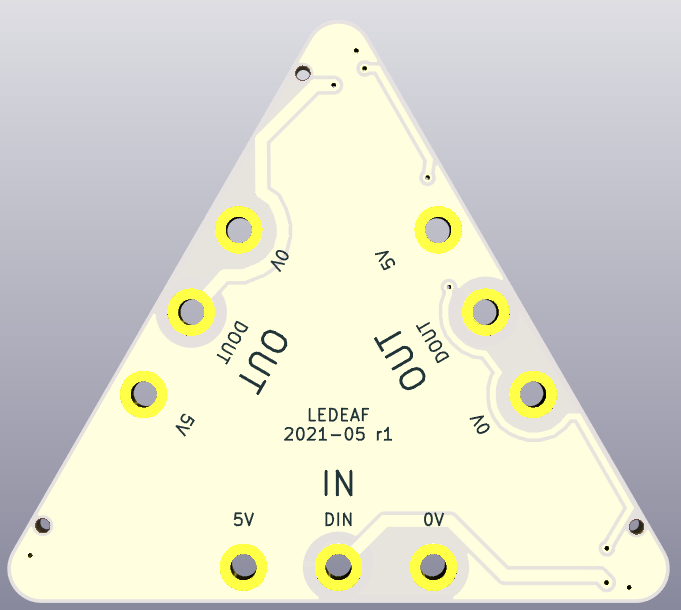
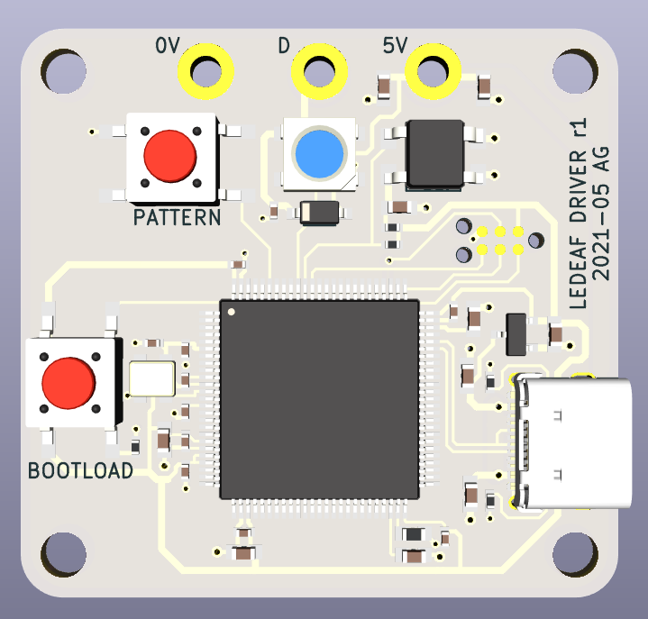

# LEDEAF

A modular LED light inspired by [@GeekMomProjects]' project. Compared to the
original, this version:

* is drawn from scratch in KiCad
* uses the attaching bolts for electrical contact, instead of spring contacts
* only requires the front acrylic sheet
* all LEDs on each panel are driven by the same input data

[@GeekMomProjects]: https://twitter.com/GeekMomProjects/status/1269671840512794624

The project is designed for SMT assembly by JLCPCB. Currently untested.

## Renders

## License

Hardware designs licensed under the [CERN-OHL-P v2].

[CERN-OHL-P v2]: cern_ohl_p_v2.txt

> You may redistribute and modify this documentation and make products
> using it under the terms of the CERN-OHL-P v2 (https:/cern.ch/cern-ohl).
> This documentation is distributed WITHOUT ANY EXPRESS OR IMPLIED
> WARRANTY, INCLUDING OF MERCHANTABILITY, SATISFACTORY QUALITY
> AND FITNESS FOR A PARTICULAR PURPOSE. Please see the CERN-OHL-P v2
> for applicable conditions
