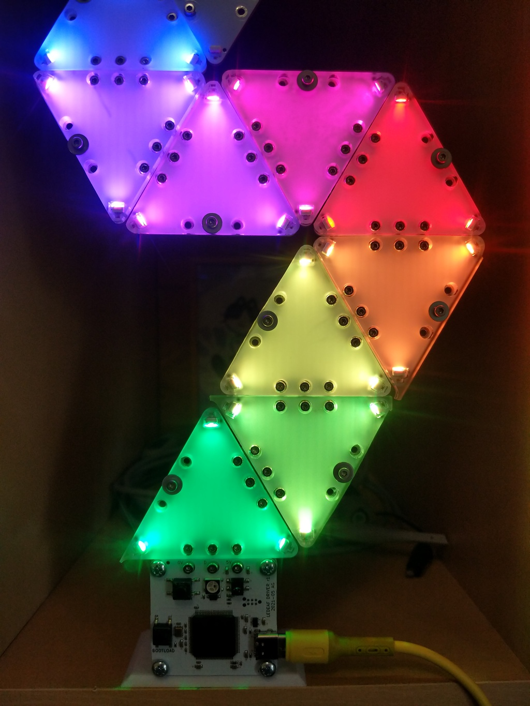
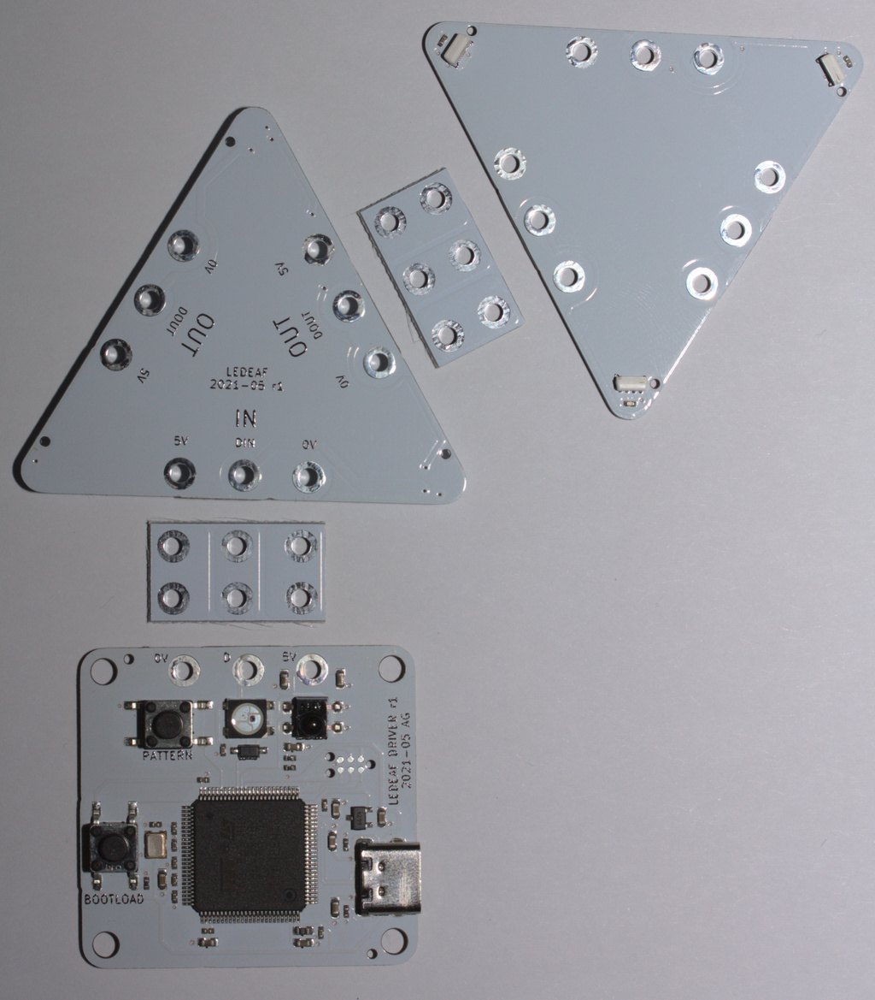

# LEDEAF

A modular LED light inspired by [@GeekMomProjects]' project. Compared to the
original, this version:

* is drawn from scratch in KiCad
* uses the attaching bolts for electrical contact, instead of spring contacts
* only requires one acrylic sheet per triangle
* all LEDs on each panel are driven by the same input data

[@GeekMomProjects]: https://twitter.com/GeekMomProjects/status/1269671840512794624

The project is designed for complete SMT assembly by JLCPCB.

## License

Hardware designs licensed under the [CERN-OHL-P v2].

[CERN-OHL-P v2]: LICENSE_CERN_OHL_P_v2.txt

> You may redistribute and modify this documentation and make products
> using it under the terms of the CERN-OHL-P v2 (https:/cern.ch/cern-ohl).
> This documentation is distributed WITHOUT ANY EXPRESS OR IMPLIED
> WARRANTY, INCLUDING OF MERCHANTABILITY, SATISFACTORY QUALITY
> AND FITNESS FOR A PARTICULAR PURPOSE. Please see the CERN-OHL-P v2
> for applicable conditions

Software licensed under the [Mozilla Public License].

[Mozilla Public License]: LICENSE_MPL.txt

> This Source Code Form is subject to the terms of the Mozilla Public
> License, v. 2.0. If a copy of the MPL was not distributed with this
> file, You can obtain one at https://mozilla.org/MPL/2.0/.
